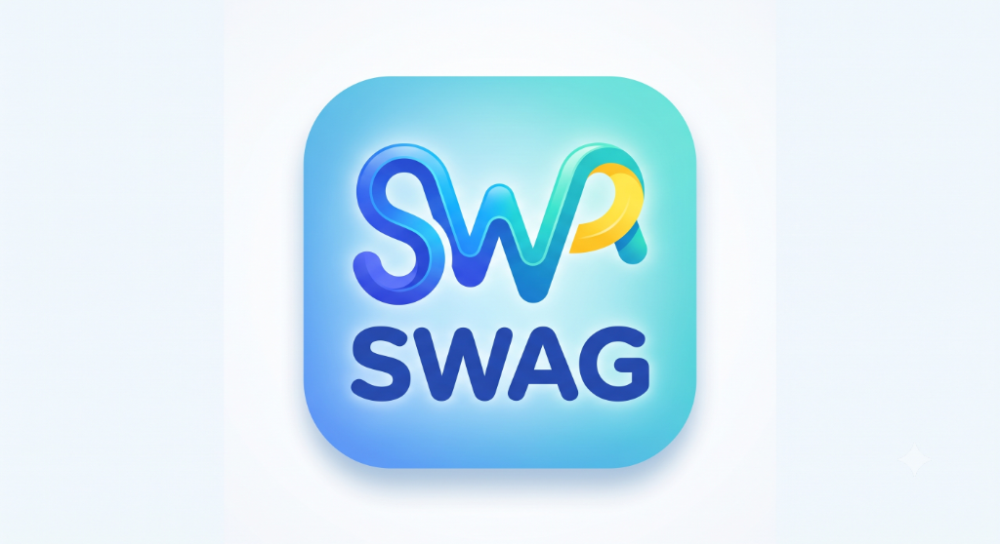
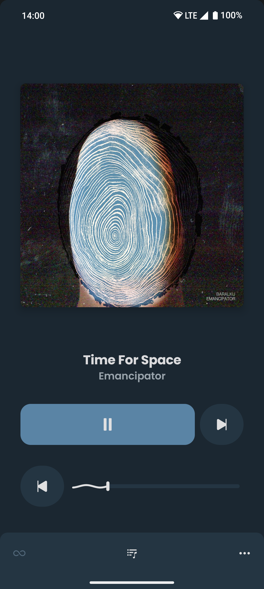

    
    <h1>Swag Music</h1>
    
A premium Android application for seamless music streaming from YouTube Music

---

  
  
  

## Features

- **Neon Dark & Purple UI**: Premium, high-contrast visual design system.
- **Ambient Glow Player**: Music player featuring dynamic background glow matching track artwork.
- **Floating Navigation Bar**: Fluid and responsive bottom navigation bar layout.
- **Direct YouTube Streaming**: Stream (almost) any song or video from YouTube Music.
- **On-Device yt-dlp & QuickJS**: High-performance local signature cipher resolving.
- **Synced Scrolling Lyrics**: Real-time lyrics matching playback position automatically.
- **Offline Caching**: Save and cache tracks for offline playback.
- **Equalizer & Normalization**: Built-in sound adjustment settings.
- **Android Auto Support**: Seamless dashboard playback for cars and scooters.

---

## Installation

### Direct GitHub Download (Recommended)
You can download the latest compiled version of the app directly from our releases:

👉 **[Download Latest Swag Music APK](https://github.com/swagat014/swagic-music/releases/download/latest/app-debug.apk)**

*Alternative badge download:*

### Play Protect Warning Note
Because this app is sideloaded directly from the browser (outside Google Play Store) and signed with a local developer certificate, Android may show a **"Blocked by Play Protect"** or **"Unsafe App Blocked"** warning.

To install:
1. Tap **"More details"** in the installation prompt.
2. Tap **"Install anyway"** to complete the setup.

---

## Disclaimer

This project is not affiliated with, authorized, or endorsed by YouTube, Google LLC, or any of its subsidiaries.
