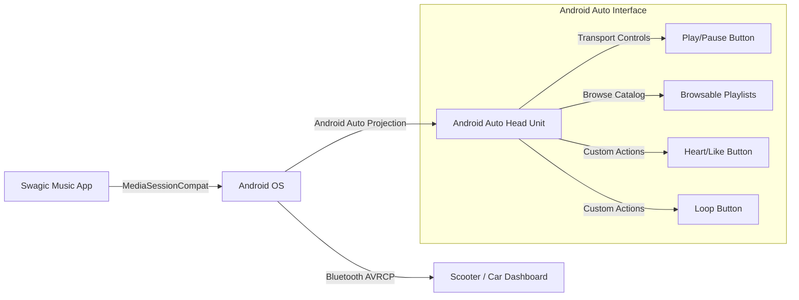

# Swagic Music — Implementation Plan & Architecture Guide

This plan outlines the design, architecture, and integration steps for building **Swagic Music**, an Android music streaming app inspired by ViTune. It features a premium custom UI, integrated streaming from YouTube Music (via on-device `yt-dlp`), and comprehensive **Android Auto Setup Controls** for cars and scooters.

---

## 1. Project Directory & Structure
We will structure the **Swagic Music** project as a modular Android application:
- **`app`**: Core application module containing the launcher Activity, Application class, and DI setup.
- **`core/ui`**: Shared UI components, dynamic themes, custom animations, and layout grids.
- **`core/playback`**: Media playback engine using Jetpack Media3 (ExoPlayer) and custom volume normalization.
- **`providers/innertube`**: YouTube Music API client wrapper.
- **`providers/lyrics`**: Wrappers for synchronized lyrics APIs (e.g., LrcLib).
- **`python/downloader`**: Chaquopy assets containing the custom `yt-dlp` extractor runtime.

---

## 2. Dynamic UI Customization (Jetpack Compose)
While ViTune uses standard Material You theming, **Swagic Music** will implement a premium, dark-mode first design:
- **Glassmorphism**: Player background with animated gradients behind a blurred glass (using Compose `graphicsLayer` and `RenderEffect`).
- **Dynamic Accent Colors**: Extraction of primary and secondary colors from song thumbnails to dynamically style the player background, buttons, and progress indicators.
- **Custom Player Layout**: Re-imagined now-playing screen with large card-based cover art, swipe gesture controls, and smooth micro-animations for play/pause toggles.

---

## 3. Playback & Android Auto Setup Controls

Unlike generic audio players, Swagic Music will configure custom controls and transport rules tailored for car dashboards and scooter displays running **Android Auto** or connected via Bluetooth.



### A. Exposing Controls to Android Auto
Android Auto UI is driven entirely by the app's `MediaSessionCompat` and its `PlaybackStateCompat`. The car screen renders controls based on the flags and actions declared by the app:

1. **Required Actions**:
   Define support for basic transport controls in your playback service:
   ```kotlin
   val defaultActions = PlaybackStateCompat.ACTION_PLAY or
           PlaybackStateCompat.ACTION_PAUSE or
           PlaybackStateCompat.ACTION_PLAY_PAUSE or
           PlaybackStateCompat.ACTION_STOP or
           PlaybackStateCompat.ACTION_SKIP_TO_PREVIOUS or
           PlaybackStateCompat.ACTION_SKIP_TO_NEXT or
           PlaybackStateCompat.ACTION_SEEK_TO
   ```

2. **Custom Android Auto Setup Controls**:
   You can add custom action buttons (like "Like/Dislike" or "Repeat Mode") directly to the main playback screen on the car display by building custom actions in your `PlaybackState`:
   ```kotlin
   val stateBuilder = PlaybackStateCompat.Builder()
       .setActions(defaultActions)
       // Add Like Button Control on Car UI
       .addCustomAction(
           PlaybackStateCompat.CustomAction.Builder(
               "ACTION_LIKE",
               "Like",
               R.drawable.ic_heart_outline
           ).build()
       )
       // Add Shuffle/Repeat Control on Car UI
       .addCustomAction(
           PlaybackStateCompat.CustomAction.Builder(
               "ACTION_LOOP",
               "Repeat Track",
               R.drawable.ic_repeat
           ).build()
       )
   ```

3. **Handling Controls Input**:
   When a user taps a control button on the Android Auto screen, the action is routed to your `MediaSessionCompat.Callback` override:
   ```kotlin
   private inner class MediaSessionCallback : MediaSessionCompat.Callback() {
       override fun onPlay() { player.play() }
       override fun onPause() { player.pause() }
       override fun onSkipToNext() { player.seekToNext() }
       override fun onSkipToPrevious() { player.seekToPrevious() }
       override fun onCustomAction(action: String?, extras: Bundle?) {
           when (action) {
               "ACTION_LIKE" -> toggleLikeStatus()
               "ACTION_LOOP" -> toggleRepeatMode()
           }
       }
   }
   ```

### B. Bluetooth & Scooter Dashboard Controls (AVRCP)
For scooters connecting via Bluetooth:
- **Metadata Sync**: Tying media metadata (`MediaMetadataCompat`) to the `MediaSession` automatically broadcasts title, artist, duration, and album art to the scooter's Bluetooth receiver.
- **Physical Controls**: Pressing physical play/pause/skip controls on the scooter's handlebars triggers the standard media receiver keys (`KeyEvent.KEYCODE_MEDIA_PLAY`, `KEYCODE_MEDIA_NEXT`, etc.), which your `MediaSession` handles directly.

---

## 4. Extraction & Streaming Pipeline

To stream music smoothly:
1. The app queries YouTube Music using the client module `providers/innertube` to search and load playlist items.
2. When the user taps a song, the app retrieves the direct streaming URL on-device using a Python runtime (via **Chaquopy**):
   - Package dependencies bundled in build script:
     ```kotlin
     chaquopy {
         defaultConfig {
             pip {
                 install("yt-dlp>=2026.06.09")
             }
         }
     }
     ```
   - On-device Python script uses `yt-dlp` to resolve signature encryption dynamically using the native JavaScript QuickJS execution engine (`libqjs.so`).
3. ExoPlayer receives the resolved stream URL and begins playing the track while concurrently caching it to the local Room DB storage.
